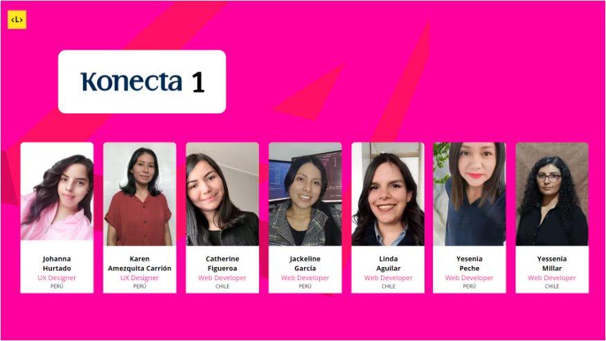
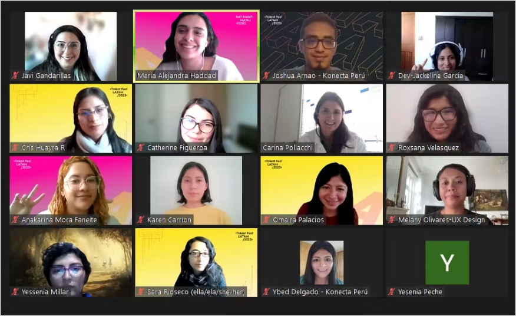

# RETO KONECTA  

## Índice

- [1. Talent Fest](#1-talent-fest)
- [2. Revelación de equipo](#2-revelación-de-equipo)
- [3. Prototipos](#3-prototipos)
- [4. Historias de Usuario](#4-historias-de-usuario)
- [5. Herramientas](#5-herramientas)

## 1. Talent Fest 

* Como parte del Talent Fest Latam 2023 Laboratoria organizó una Hackathon. En la hackathon las empresas participantes presentaron un proyecto de integración de Inteligencia Artificial en el cual trabajaron de la mano de un squad de egresadas de Laboratoria para aplicarlo a una necesidad específica de su negocio, construyendo un prototipo funcional (MVP).  
* Para la hackathon se le asignó a cada empresa un squad de entre 4-5 egresadas Web Developers de Colombia, Chile, Ecuador, México y/o Perú con quienes cada empresa trabajó en la solución del reto que la empresa trajo a la mesa. El tiempo de desarrollo del reto fue de 4 días (23 al 26 de octubre), y 1 día (30 de octubre) para presentar su solución.
* La empresas dispusieron de 1-2 Product Owners para que lideran el reto y el squad. Así también, cada squad tuvo un mentor/a de Laboratoria para acompañarlos durante la experiencia. Los squads trabajaron usando los principios ágiles para organizarse y hacer el seguimiento del progreso del reto día a día y lograr el MVP.  

## 2. Revelación de equipo

Tres días antes de la Hackathon, cada empresa se reunió con su squad, donde el equipo al que pertenecí fue al equipo 1 de la compañía Konecta

Aqui se muestra a los equipos 1 y 2 reunidos 

## 3. Prototipos

## 4. Historias de Usuario

## 5. Herramientas

