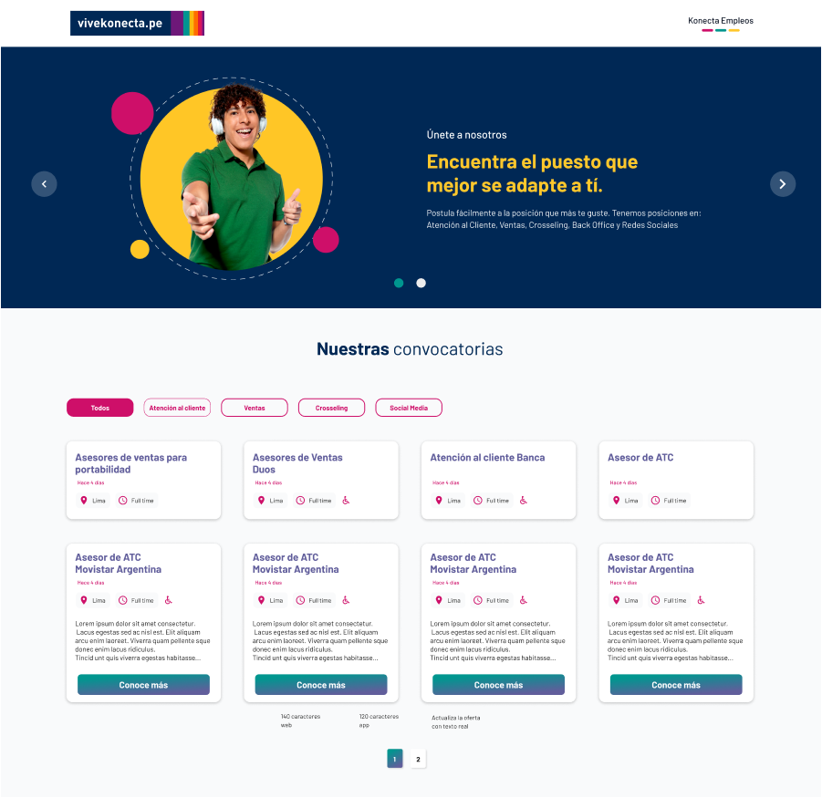
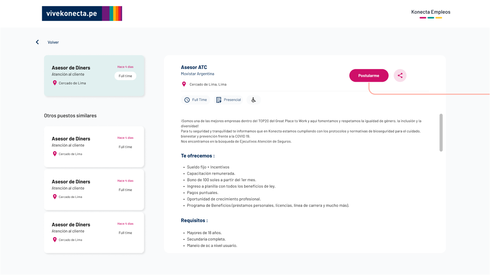
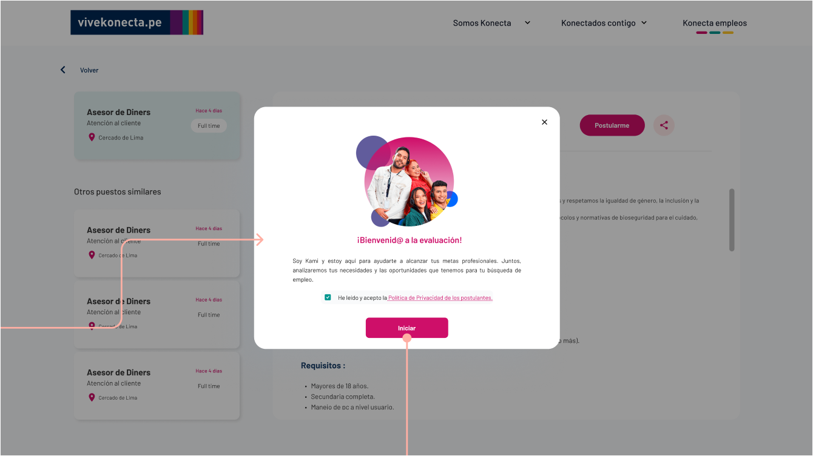
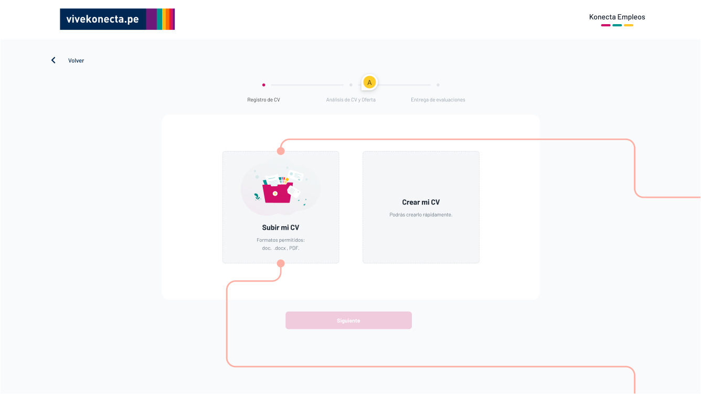
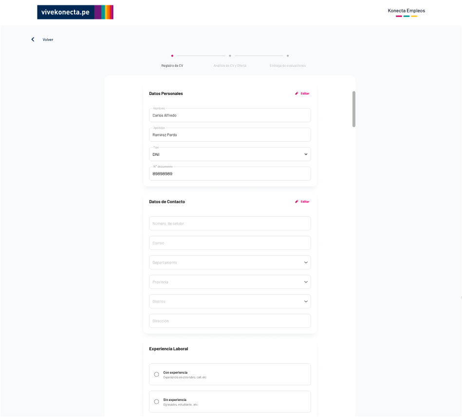
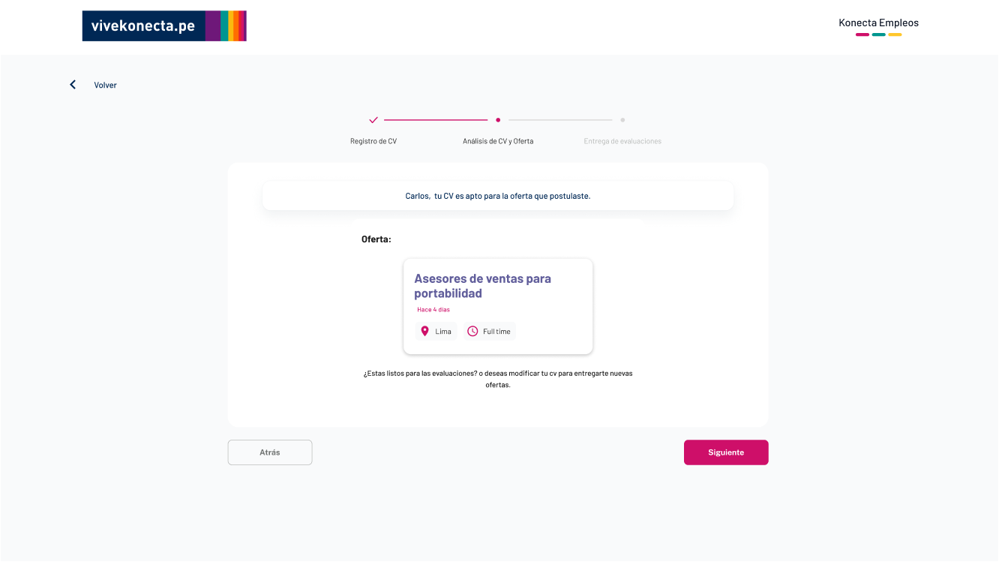
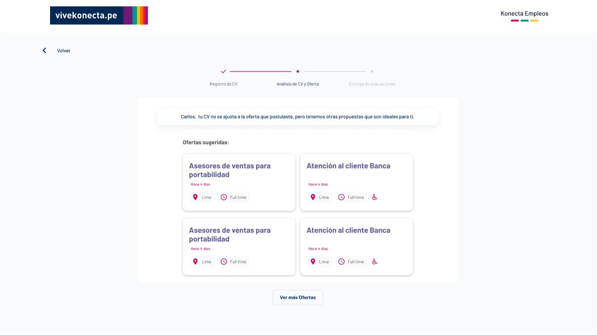
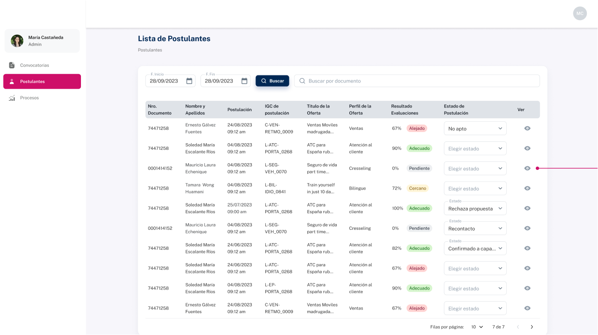

# RETO KONECTA  

## Índice

- [1. Talent Fest](#1-talent-fest)
- [2. Revelación de equipo](#2-revelación-de-equipo)
- [3. Prototipos](#3-prototipos)
- [4. Historias de Usuario](#4-historias-de-usuario)
- [5. Herramientas](#5-herramientas)

## 1. Talent Fest 

Como parte del Talent Fest Latam 2023 Laboratoria organizó una Hackathon. En la hackathon las empresas participantes presentaron un proyecto que integraba Inteligencia Artificial. El proyecto se trabajo de la mano con un squad de egresadas de Laboratoria para aplicarlo a una necesidad específica de su negocio construyendo un prototipo funcional (MVP).

Los squads se conformaron por 4 a 5 egresadas Web Developers de Colombia, Chile, Ecuador, México y/o Perú con quienes cada empresa trabajó en la solución del reto que la empresa trajo a la mesa. El tiempo de desarrollo del reto fue de 4 días (23 al 26 de octubre), y 1 día (30 de octubre) para presentar su solución.

La empresas dispusieron de 1-2 Product Owners para que lideran el reto y el squad. Así también, cada squad tuvo un mentor/a de Laboratoria para acompañarlos durante la experiencia. Los squads trabajaron usando los principios ágiles para organizarse y hacer el seguimiento del progreso del reto día a día y lograr el MVP.  

## 2. Equipo de trabajo

La empresa Konecta dispuso de dos equipos, siendo el presente proyecto desarrollado por el equipo 1.

## 3. Prototipos

Para realizar el proyecto la empresa dispuso del prototipo, el cual está dividido en secciones.

🌱 Presentación de las ofertas laborales

🌱 Descripción de las ofertas laborales 

🌱 Bienvenida

🌱 Validación

🌱 Cargar CV

🌱 Crear CV de forma manual

🌱 Oferta exitosa 

🌱 Oferta fallida

🌱 Vista del administrador

Así mismo el diseño completo fue desarrollado en [Figma](https://www.figma.com/file/4KNUPIHBfQ9rbqWJUz3ke6/Hackathon-Laboratoria-%F0%9F%A9%B7%F0%9F%92%9B?type=design&node-id=0-1&mode=design&t=GTegUlktvrbvo5LB-0)

## 4. Historias de Usuario

**Historia de Usuario 2**

Como Selector puedo visualizar la lista de postulantes de modo que pueda hacer seguimiento a las postulaciones.

Criterios de aceptación:
1. Se debe contar con una tabla con los registros de las postulaciones que contenga los siguientes datos: documento, nombre y apellido completos, nombre de IGC ( relacionado a una oferta), porcentaje ( cercanía con el perfil de la oferta), estado del postulante, estado de su evaluación (“Adecuado”, “Cercano”, “Lejano”).
2. Se debe contar con un botón (icono de visualización) para su perfil donde se encontrará a detalle la información extraída del cv o ingresada por el postulante: datos personales, experiencia laboral, estudios, y más. (opcional)
2. Se debe contar con la opción de filtro por rango de fecha y búsqueda por documento.
3. Puedo actualizar el estado del postulante durante el proceso de selección con los siguientes estados: “Confirmado a capacitación” , “Rechaza propuesta”, “Re-contactado” etc.
4. Se enviará una notificación al postulante cuando no haya realizado sus evaluaciones por whatsapp según el siguiente estado: “Re-contactado” .
5. Se enviará una notificación al postulante por whatsapp cuando se confirme su capacitación con un mensaje de bienvenida según el siguiente estado: “Confirmado a capacitación”.

**Historia de Usuario 3**

Como Postulante puedo ver ofertas laborales de modo que pueda ordenar, filtrar y ver el detalle de cada una de ellas. 

Criterios de aceptación:
1. Se debe mostrar una lista de las convocatorias en formato cards, ordenadas ascendentemente por fecha de publicación.
2. Se debe mostrar la sección de filtro por categoría ( perfiles: ‘Atención al cliente ","Ventas", "Crosselling " y, "Social Media” ), e inicialmente todas las convocatorias se visualizarán desde la categoría: “Todos”.
3. Cada card de la convocatoria contendrá lo siguiente: título, fecha, sede, modalidad, apto para todos y descripción de la oferta ( solo 140 caracteres en desktop y 120 en móvil ), asimismo tendrá un botón: “Conoce más”, que permitirá redirigir a una vista detalle, donde se encontrará mayor información de la oferta.
4. El filtrado de la información debe ser manejado en el lado frontend, ya que el servicio simplemente proporciona toda la información disponible.

**Historia de Usuario 4**

Como Postulante puedo ver detalles de la oferta de modo que pueda compartirla y posteriormente aplicar. 

Criterios de aceptación:
1. Se debe mostrar el detalle de oferta que incluya lo siguiente: título, descripción ( toda la descripción), sede, modalidad, tipo de trabajo y apto para todos.
2. Cada oferta debe contener dos botones : Compartir (Icono) y “Postularme”
3. El icono compartir debe permitir enviar el link de la oferta a redes sociales como: Facebook, Whatsapp, Twitter ó copiar la URL.
4. Se debe mostrar las ofertas similares ( misma categoría de la oferta seleccionada) en la sección lateral izquierda (Solo el la versión desktop).
5. El detalle de cada oferta debe ser manejado en el lado frontend, ya que el servicio simplemente proporciona toda la información disponible, asimismo el filtrado por categoría similar.

**Historia de Usuario 5**

Como postulante puedo aplicar a la oferta de modo que pueda cargar mi cv o dejar mis datos

Criterios de aceptación:
1. Al hacer clic en “Postularme”, se deben realizar las siguientes acciones, después de el modal de bienvenida ( donde aceptas los términos y políticas):

a. Verificar en una base de datos:
- Debe aparecer un modal con un campo para ingresar nombres, apellidos, documento de identidad y tipo.
- Al darle click al botón: “Siguiente” se debe realizar la verificación en la base de datos (blacklist). Si el documento está en la base de datos “blacklist” se mostrará un mensaje al postulante indicando que tiene un proceso en curso y no puede aplicar a esa oferta. (opcional)

b. Verificar estado de postulación:
- Se debe verificar si el postulante ya tiene un proceso en curso para la oferta seleccionada.Si tiene una postulación en curso se le indicará el título de la oferta y estado.

c. Validar CV:
- Si el postulante no cuenta con un proceso en curso, debe continuar. Se debe mostrar la opción de elegir si tiene un curriculum vitae para cargar: “Subir mi CV” o no: “Crear mi CV”.

d. Cargar CV o dejar datos:
- Si el postulante tiene cv, podrá cargar un archivo de tipo : pdf o word (docx o doc).
- Si no, tendrá la opción de llenar la información requerida en un formulario.

e. Enviar CV para crear perfil y comparar con oferta:
- Una vez que el postulante ha cargado su CV, se debe extraer la información del documento y enviar automáticamente a una IA para crear un perfil del postulante ( texto resumen del cv del postulante) y compararlo con el perfil requerido por la oferta. Cada oferta está relacionada a un perfil.
- Si no se logra extraer los datos suficientes debe mostrarse un formulario para completarlos.
- En caso haya logrado obtener algunos debe resaltarse los campos que no pudieron ser leídos (opcional).
- Si se hace match, debe mostrar los pasos de cómo rendir sus evaluaciones, y automáticamente enviar el link de las evaluaciones por whatsapp ( al número registrado).
- Si no hay un match con la oferta, se debe verificar con qué otro perfil hace match y mostrar las ofertas que se adapten a ese perfil (Max 5). Recordar que el perfil es la categoría de la oferta.

f. Guardar datos del postulante
- Se debe guardar la información del postulante después de verificar el match.

## 5. TECNOLOGÍAS

💻 **REACT**

  

💻 **JAVASCRIPT**

💻 **MATERIAL UI**

💻 **FIGMA**

  

💻 **FIREBASE**

  

💻 **GIT**

  

💻 **ENDPOINTS**
- [ENDPOINTS](https://documenter.getpostman.com/view/17741188/2s9YJez2Bq#5c4bd7fc-95fc-4388-90a4-ec28c872c0d4)

